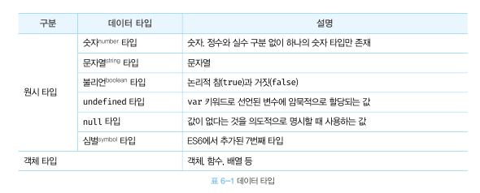
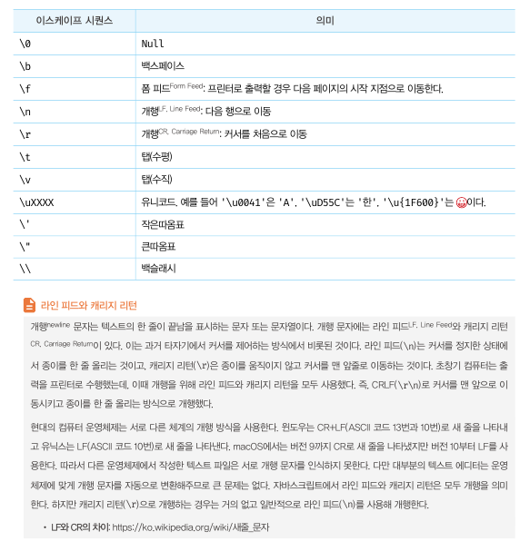

자바스크립트(ES6)는 7개의 데이터 타입을 제공하며 원시 타입, 객체 타입 으로 분류된다. 

> 예를 들어 숫자 타입 1과 문자 타입 1은 같아 보이지만 <br>
> 확보해야 하는 메모리 공간의 크기, 메모리에 저장되는 2진수, 읽어 들여 해석하는 방식 등 전혀 다르다.  


## 숫자 타입
C나 JAVA 의 경우 정수와 실수를 구분해서 `int, long, float, double` 등 여러 숫자 타입이 제공되지만 자바스크립트는 하나의 숫자 타입만 존재한다.<br>
ECMAScript 사양에 따르면 숫자 타입의 값은 배정밀도 64비트 부동소수점 형식을 따른다.<br>
정수, 실수, 2진수, 8진수, 16진수 리터널은 모두 2진수로 저장되며, 이들 값을 참조하면 모두 10진수로 해석된다.
`즉, 모든 수를 실수로 처리하며, 정수만 표현하기 위한 테이터 타입이 별로도 존재 하지 않는다.`<br>
모두 실수로 처리되기 때문에 정수로 표시되도 수끼리 나누더라도 실수가 나올 수 있다.
```javascript
// 모두 숫자 타입이다.
var integer = 10;    // 정수
var double = 10.12;  // 실수
var negative = -20;  // 음의 정수
```
```javascript
var binary = 0b01000001; // 2진수
var octal = 0o101;       // 8진수
var hex = 0x41;          // 16진수

// 표기법만 다를 뿐 모두 같은 값이다.
console.log(binary); // 65
console.log(octal);  // 65
console.log(hex);    // 65
console.log(binary === octal); // true
console.log(octal === hex);    // true
```
```javascript
// 숫자 타입은 모두 실수로 처리된다.
console.log(1 === 1.0); // true
console.log(4 / 2);     // 2
console.log(3 / 2);     // 1.5
```
숫자 타입은 추가적으로 세가지 특별한 값도 표현할 수 있다.
```javascript
// 숫자 타입의 세 가지 특별한 값
console.log(10 / 0);       // Infinity : 양의 무한대
console.log(10 / -0);      // -Infinity : 음의 무한대
console.log(1 * 'String'); // NaN : 산술 연산 불가(not a number)
```

## 문자열 타입
문자열은 0개 이상의 16비트 유니코드 문자(UTF-16)의 집합으로 전 세계 대부분의 문자를 표현할 수 있다.<br>
문자열 표현 방법은 아래와 같다.
```javascript
// 문자열 타입
var string;
string = '문자열'; // 작은따옴표
string = "문자열"; // 큰따옴표
string = `문자열`; // 백틱 (ES6)

string = '작은따옴표로 감싼 문자열 내의 "큰따옴표"는 문자열로 인식된다.';
string = "큰따옴표로 감싼 문자열 내의 '작은따옴표'는 문자열로 인식된다.";
```

## 템플릿 리터널
ES6부터 템플릿 리터럴 이라고 하는 새로운 문자열 표기법이 도입되었다.<br>
템플릿 리터럴은 멀티라인 문자열, 표현식 삽입, 태그드 템플릿 등 편리한 문자열 처리 기능을 제공한다.<br>
템플릿 리터널은 일반적인 따옴표 대신 백틱(``)을 사용한다.
```javascript
var template = `Template literal`;
console.log(template); // Template literal
```
### 멀티라인 문자열

#### ES6 이전

```javascript
var template = '<ul>\n\t<li><a href="#">Home</a></li>\n</ul>';

console.log(template);
/*
<ul>
  <li><a href="#">Home</a></li>
</ul>
*/
```
#### ES6 부터
```javascript
var template = `<ul>
  <li><a href="#">Home</a></li>
</ul>`;

console.log(template);
/*
<ul>
  <li><a href="#">Home</a></li>
</ul>
*/
```

### 표현식 삽입

#### ES6 이전
```javascript
var first = 'Ung-mo';
var last = 'Lee';

// ES5: 문자열 연결
console.log('My name is ' + first + ' ' + last + '.'); // My name is Ung-mo Lee.
```

### ES6 부터
```javascript
var first = 'Ung-mo';
var last = 'Lee';

// ES6: 표현식 삽입
console.log(`My name is ${first} ${last}.`); // My name is Ung-mo Lee.
```

## 불리언 타입
불리언 타입의 값은 논리적 참, 거짓을 나타내는 true와 false 뿐이다.
```javascript
var foo = true;
console.log(foo); // true

foo = false;
console.log(foo); // false
```

## undefined 타입
var 키워드를 통해 선언한 변수는 암묵으로 undefined 로 초기와 되며, 값이 할당이 이루어질 때까지 undefined 이다.<br>
초기화 하는데 사용되는 undefined 개발자가 의도적으로 할당하면 본래 취지와 어긋날 뿐더러 혼란을 줄수 있으므로 권장하지 않는다.<br>
변수에 값이 없다고 명시 하고 싶을때는 undefined 가 아니라 unll을 할당한다.

## null 타입
null 타입의 값은 null이 유일하다. 자바스크립트는 대소문자를 구별하므로 Null, NULL 등과 다르다.<br>
null 은 변수의 값이 없다는 것을 의도적으로 명시 할때 사용한다. <br>
함수가 유효안 값을 반환할 수 없는 경우 명시적로 null을 반환하기도 한다.
```html
<!DOCTYPE html>
<html>
<body>
  <script>
    var element = document.querySelector('.myClass');

    // HTML 문서에 myClass 클래스를 갖는 요소가 없다면 null을 반환한다.
    console.log(element); // null
  </script>
</body>
</html>
```

## 심벌 타입
심벌은 ES6에서 추가된 7번째 타입으로, 변경 불가능한 원시 타입의 값이다.<br>
심벌 값은 다른 값과 중복 되지 않는 유일무이한 값이여야 해서 주로 이름이 출돌한 위험이 없는 객체의 유일한 프로퍼티 키를 만들기 위해 사용한다.
```javascript
// 심벌 값 생성
var key = Symbol('key');
console.log(typeof key); // symbol

// 객체 생성
var obj = {};

// 이름이 충돌할 위험이 없는 유일무이한 값인 심벌을 프로퍼티 키로 사용한다.
obj[key] = 'value';
console.log(obj[key]); // value
```

## 데이터 타입의 필요성
- 값을 저장할 때 확보해야 하는 메모리 공간의 크기를 결정하기 위해
- 값을 참조할 때 한 번에 읽어 들여야 할 메모리 공간의 크기를 결정하기 위해
- 메모리에서 읽어 들인 2진수를 어떻게 해석할지 결정하기 위해 

## 동적 타이핑
자바스크립트의 변수는 선언이 아닌 할당에 의해 타입이 결정된다. 그리고 재할당에 의해 변수의 타입은 언제든지 동적으로 변할 수 있다. 이러한 특징을 `동적 타이핑`이라고 한다.
```javascript
var foo;
console.log(typeof foo);  // undefined

foo = 3;
console.log(typeof foo);  // number

foo = 'Hello';
console.log(typeof foo);  // string

foo = true;
console.log(typeof foo);  // boolean

foo = null;
console.log(typeof foo);  // object

foo = Symbol(); // 심벌
console.log(typeof foo);  // symbol

foo = {}; // 객체
console.log(typeof foo);  // object

foo = []; // 배열
console.log(typeof foo);  // object

foo = function () {}; // 함수
console.log(typeof foo);  // function
```

### 변수 사용할 때 주의항 사항
- 변수는 꼭 필요한 경우에 한해 제한적으로 사용한다. 변수 값은 재할당에 의해 언제든지 변경될 수 있다. 이로 인해 동적 타입 언어인 자바스크립트는
타입을 잘못 예측해 오류가 발생할 가능성이 크다. 변수의 개수가 많으면 많을수록 오류가 발생할 확률도 높아진다. 따라서 변수의 무분별한
남발은 금물이며, 필요한 만큼 최소한으로 유지하도록 주의해야 한다.
- 변수의 유효 범위(스코프)는 최대한 좁게 만들어 변수의 부작용을 억제해야 한다. 변수의 유효 범위가 넓을수록 변수로 인해 오류가 발생활 확률이
높아진다.
- 전역 변수는 최대한 사용하지 않도록 한다.
- 변수보다는 상수를 사용해 값의 변경을 억제한다.(const)
- 변수 이름은 변수의 목적이나 의미를 파악할 수 있도록 네이밍 한다.
