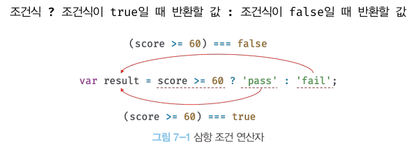
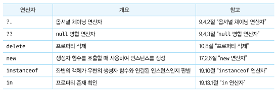

연산자 *operator* 는 하나 이상의 표현식을 대상으로 산술, 할당, 비교, 논리, 타입, 지수 연산  _operation_ 등을 수행해 하나의 값을 만든다.
이때 연산의 대상을 피연산자 _operand_ 라 한다. 피 연산자는 값으로 평가될 수 있는 표현식이어야 한다. 그리고 피연산자와 연산자의 조합으로 이뤄진 연산자 표현식도 
값으로 평가될 수 있는 표현식이다.
```javascript
// 산술 연산자
5 * 4 // -> 20

// 문자열 연결 연산자
'My name is ' + 'Lee' // -> 'My name is Lee'

// 할당 연산자
color = 'red' // -> 'red'

// 비교 연산자
3 > 5 // -> false

// 논리 연산자
true && false // -> false

// 타입 연산자
typeof 'Hi' // -> string
```
피연산자가 "값"이라는 명사의 역할을 한다면 연사자는 "피연산자를 연산하여 새로운 값을 만든다"라는 동사의 역할을 한다고 볼 수 있다.
피연산자는 연산의 대상이 되어야 하므로 값으로 평가할 수 있어야 한다. 연산자는 값으로 평가된 피연산자를 연산해 새로운 값을 만든다.

## 산술 연산자
산술 연산자 *arithmetic operator*는 피 연산자를 대상으로 수학적 계산을 수행해 새로운 숫자 값을 만든다. 산술 연산이 불가능한 경우, `NaN`을 반환한다.

### 이항 산술 연산자
이항 _binary_ 산술 연산자는 2개의 피연산자를 산술 연한하여 숫자 값을 만든다.

> 부수효과 : 피연산자의 값이 바뀌는 경우
```javascript
5 + 2; // -> 7
5 - 2; // -> 3
5 * 2; // -> 10
5 / 2; // -> 2.5
5 % 2; // -> 1
```

### 단항 산술 연산자
단항 _unary_ 산술 연산자는 1개의 피연산자를 산술 한다.

```javascript
var x = 1;

// ++ 연산자는 피연산자의 값을 변경하는 암묵적 할당이 이뤄진다.
x++; // x = x + 1;
console.log(x); // 2

// -- 연산자는 피연산자의 값을 변경하는 암묵적 할당이 이뤄진다.
x--; // x = x - 1;
console.log(x); // 1
```
증가/감소(++/--) 연산자는 위치에 따라 의미가 다르다.
- 전위 증가/감소 : 피연산자의 값을 증가/감소 시킨 후 다른연산 수행
- 후위 증가/감소 : 다른연산을 수행 수 피연산자의 값을 증가/감소
```javascript
var x = 5, result;

// 선할당 후증가(postfix increment operator)
result = x++;
console.log(result, x); // 5 6

// 선증가 후할당(prefix increment operator)
result = ++x;
console.log(result, x); // 7 7

// 선할당 후감소(postfix decrement operator)
result = x--;
console.log(result, x); // 7 6

// 선감소 후할당 (prefix decrement operator)
result = --x;
console.log(result, x); // 5 5
```
`+/- 단항 연산자를 사용하면 피연산자를 숫자 타입으로 변환하여 반환한다. 이때 피연산자를 변경하는 것은 아니고
숫자 타입으로 변환한 값을 생성해서 반환하기 때문에 부수효과는 없다.
```javascript
var x  = '1';

// 문자열을 숫자로 타입 변환한다.
console.log(+x); // 1
// 부수 효과는 없다.
console.log(x);  // "1"

// 불리언 값을 숫자로 타입 변환한다.
x = true;
console.log(+x); // 1
// 부수 효과는 없다.
console.log(x);  // true

// 불리언 값을 숫자로 타입 변환한다.
x = false;
console.log(+x); // 0
// 부수 효과는 없다.
console.log(x);  // false

// 문자열을 숫자로 타입 변환할 수 없으므로 NaN을 반환한다.
x = 'Hello';
console.log(+x); // NaN
// 부수 효과는 없다.
console.log(x);  // "Hello"


// 부호를 반전한다.
-(-10); // -> 10

// 문자열을 숫자로 타입 변환한다.
-'10'; // -> -10

// 불리언 값을 숫자로 타입 변환한다.
-true; // -> -1

// 문자열은 숫자로 타입 변환할 수 없으므로 NaN을 반환한다.
-'Hello'; // -> NaN
```
### 문자열 연결 연산자
`+ 연산자는 피연산자 중 하나 이상이 문자열인 경우 문자열 연결 연산자로 동작한다.
```javascript
// 문자열 연결 연산자
'1' + 2; // -> '12'
1 + '2'; // -> '12'

// 산술 연산자
1 + 2; // -> 3

// true는 1로 타입 변환된다.
1 + true; // -> 2

// false는 0으로 타입 변환된다.
1 + false; // -> 1

// null은 0으로 타입 변환된다.
1 + null; // -> 1

// undefined는 숫자로 타입 변환되지 않는다.
+undefined;    // -> NaN
1 + undefined; // -> NaN
```
> 자바스크립트 엔진은 위의 예제중 true, false, null 등이 1, 0 ,0 와 같이 암묵적으로 타입이 자동 변경되기도 한다. 이를 '암묵적 타입 변환', '타입 강제 변환'이라고 한다.

## 할당 연산자
할당 연산자는 우항에 있는 피연산자의 평가 결과를 좌항에 있는 변수에 할당한다.

```javascript
var x;

x = 10;
console.log(x); // 10

x += 5; // x = x + 5;
console.log(x); // 15

x -= 5; // x = x - 5;
console.log(x); // 10

x *= 5; // x = x * 5;
console.log(x); // 50

x /= 5; // x = x / 5;
console.log(x); // 10

x %= 5; // x = x % 5;
console.log(x); // 0

var str = 'My name is ';

// 문자열 연결 연산자
str += 'Lee'; // str = str + 'Lee';
console.log(str); // 'My name is Lee'
```
> 할당문은 값으로 평가되는 표현식 문으로서 할당된 값으로 평가되므로 할당문을 다른 변수에 할당할 수도 있다.

## 비교 연산자
비교 연산자는 좌항과 우항의 피연산자를 비교한 다음 그 결과를 불리언 값으로 반환한다.

### 동등/일치 비교 연산자
동등 비교 연산자와 일치 비교연산자는 좌항과 우항의 피연산자가 같은 값으로 평가되는지 boolean 값을 반환한다.

- 동등 비교(==) 연산자는 좌항과 우항의 피연산자를 비교할 때 먼저 암묵적 타입 변환을 통해 타입을 일치시킨 후 같은 값인지 비교한다.
```javascript
// 동등 비교
5 == 5; // -> true

// 타입은 다르지만 암묵적 타입 변환을 통해 타입을 일치시키면 동등하다.
5 == '5'; // -> true
```
- 일치 비교(===) 연산자는 좌항과 우항의 피연산자가 타입도 같고 값도 같은 경우에 한하여 true를 반환한다.
```javascript
// 일치 비교
5 === 5; // -> true

// 암묵적 타입 변환을 하지 않고 값을 비교한다.
// 즉, 값과 타입이 모두 같은 경우만 true를 반환한다.
5 === '5'; // -> false
```
- NaN은 자신과 일치하지 않는 유일한 값이다. 숫자가 NaN 인지 조사하려면 빌트인 함수 Number.isNaN을 사용한다.
```javascript
// NaN은 자신과 일치하지 않는 유일한 값이다.
NaN === NaN; // -> false

// Number.isNaN 함수는 지정한 값이 NaN인지 확인하고 그 결과를 불리언 값으로 반환한다.
Number.isNaN(NaN); // -> true
Number.isNaN(10);  // -> false
Number.isNaN(1 + undefined); // -> true
```
- 양의 0과 음의 0이 있는데 이들을 비교하면 true를 반환한다.
```javascript
// 양의 0과 음의 0의 비교. 일치 비교/동등 비교 모두 결과는 true이다.
0 === -0; // -> true
0 == -0;  // -> true
```
- 동등 비교 연산자(==), 일치 비교 연산자(===)는 +0과 -0을 동일하게 편가한다. 또한 동일한 값인 NaN과 NaN을 비교하면 다른 값이라고 평가한다.<br>
ES6에서 도입괸 Object.is 메서드는 다음과 같이 예측 가능한 정확한 비교 결과를 반환한다. 그외에는 일치 비교 연산자(===)와 동일하게 동작한다.
```javascript
-0 === +0;         // -> true
Object.is(-0, +0); // -> false

NaN === NaN;         // -> false
Object.is(NaN, NaN); // -> true
```

- 부동등 비교 연산자(!=)와 불일치 비교 연산자(!==)
```javascript
// 부동등 비교
5 != 8;   // -> true
5 != 5;   // -> false
5 != '5'; // -> false

// 불일치 비교
5 !== 8;   // -> true
5 !== 5;   // -> false
5 !== '5'; // -> true
```
### 대소 관계 비교 연산자
대소 관계 비교 연산자는 피연산자의 크기를 비교하여 boolean 값으로 반환한다.

```javascript
// 대소 관계 비교
5 > 0;  // -> true
5 > 5;  // -> false
5 >= 5; // -> true
5 <= 5; // -> true
```

## 삼상 조건 연산자
삼항 조건 연산자는 조건식의 평가 결과에 따라 반환할 값을 결정한다. 자바스크립트의 유일한 삼항 연산자이며, 부수 효과는 없다.

```javascript
var x = 2;

// 2 % 2는 0이고 0은 false로 암묵적 타입 변환된다.
var result = x % 2 ? '홀수' : '짝수';

console.log(result); // 짝수
```
삼상 연산자와 if...else...  문의 중요한 차이는 삼상 조건 연산자 표현식은 값처럼 사용할 수 있다는 것이다.

- if...else...
```javascript
var x = 10;

// if...else 문은 표현식이 아닌 문이다. 따라서 값처럼 사용할 수 없다.
var result = if (x % 2) { result = '홀수'; } else { result = '짝수'; };
// SyntaxError: Unexpected token if
```
- 삼항 조건 연산자
```javascript
var x = 10;

// 삼항 조건 연산자 표현식은 표현식인 문이다. 따라서 값처럼 사용할 수 있다.
var result = x % 2 ? '홀수' : '짝수';
console.log(result); // 짝수
```
## 논리 연산자
논리 연산자는 우항과 좌항의 피연산자를 노리 연산한다.

```javascript
// 논리합(||) 연산자
true || true;   // -> true
true || false;  // -> true
false || true;  // -> true
false || false; // -> false

// 논리곱(&&) 연산자
true && true;   // -> true
true && false;  // -> false
false && true;  // -> false
false && false; // -> false

// 논리 부정(!) 연산자
!true;  // -> false
!false; // -> true
```
- 논리 부정(!) 연산자는 언제나 불르언 값을 반환한다. 단, 피연산자가 반드시 불리언 값일 필요는 없다.
```javascript
// 암묵적 타입 변환
!0;       // -> true
!'Hello'; // -> false
```
- 논리합(||) 또는 논리곱(&&) 연산자 표현식의 평가 결과는 불리언 값이 아닐 수도 있다.

```javascript
// 단축 평가
'Cat' && 'Dog'; // -> 'Dog'
```
- 드모르간 법칙
```javascript
!(x || y) === (!x && !y)
!(x && y) === (!x || !y)
```
## 쉽표 연산자
쉽표 연산자는 왼쪽 피연산자부터 차례대로 피연산자를 평가하고 마지막 피연산자의 평가가 끝나면 마지막 피연산자의 평가 결과를 반환한다.
```javascript
var x, y, z;

x = 1, y = 2, z = 3; // 3
```
## 그룹 연산자
소괄호로 피연산자를 감싸는 그룹 연산자는 자신의 피연산자의 표현식을 가장 먼저 평가한다.
```javascript
10 * 2 + 3; // -> 23

// 그룹 연산자를 사용하여 우선순위를 조절
10 * (2 + 3); // -> 50
```

## typeof 연산자
typeof 연산자는 피연산자의 데이터 타입을 문자열로 반환한다.(string, number, boolean, undefined, symbol, object, function)
```javascript
typeof ''              // -> "string"
typeof 1               // -> "number"
typeof NaN             // -> "number"
typeof true            // -> "boolean"
typeof undefined       // -> "undefined"
typeof Symbol()        // -> "symbol"
typeof null            // -> "object"
typeof []              // -> "object"
typeof {}              // -> "object"
typeof new Date()      // -> "object"
typeof /test/gi        // -> "object"
typeof function () {}  // -> "function"
```

## 지수 연산자
ES7에서 도입된 지수 연산자는 좌항의 피연산자로 우항의 피연산자를 지수로 거듭제곱하여 숫자 값을 반환한다.
```javascript
2 ** 2;   // -> 4
2 ** 2.5; // -> 5.65685424949238
2 ** 0;   // -> 1
2 ** -2;  // -> 0.25
```
- 지수 연산자가 도입되기 이전에는 Math.pow 메서드를 사용했다.
```javascript
Math.pow(2, 2);   // -> 4
Math.pow(2, 2.5); // -> 5.65685424949238
Math.pow(2, 0);   // -> 1
Math.pow(2, -2);  // -> 0.25
```

- 지수 연산자는 다음과 같은 경우 Math.pow 메서드 보다 가독성이 좋다.
```javascript
// 지수 연산자의 결합 순서는 우항에서 좌항이다. 즉, 우결합성을 갖는다.
2 ** (3 ** 2); // -> 512
Math.pow(2, Math.pow(3, 2)); // -> 512
```
- 음수를 거듭제곱 하여 계산하면 괄호로 묶어야 한다.
```javascript
-5 ** 2;
// SyntaxError: Unary operator used immediately before exponentiation expression.
// Parenthesis must be used to disambiguate operator precedence

(-5) ** 2; // -> 25
```
- 지수 연산자는 다른 산술 연산자와 마찬가지로 할당 연산자와 함께 사용할 수 있으며 이항연산자 중에서 우선순위가 가장 높다.
```javascript
var num = 5;
num **= 2; // -> 25

2 * 5 ** 2; // -> 50
```
## 그 외의 연산자


## 연산자의 부수 효과
대부분의 연산자는 다른 코드에 영향을 주지 않고 새로운 값을 생성하며,<br>
부수 효과가 있는 연산자는 할당 연산자(=), 증가/감소 연산자(++/--), delete 연산자다.
```javascript
var x;

// 할당 연산자는 변수 값이 변하는 부수 효과가 있다.
// 이는 x 변수를 사용하는 다른 코드에 영향을 준다.
x = 1;
console.log(x); // 1

// 증가/감소 연산자(++/--)는 피연산자의 값을 변경하는 부수 효과가 있다.
// 피연산자 x의 값이 재할당되어 변경된다. 이는 x 변수를 사용하는 다른 코드에 영향을 준다.
x++;
console.log(x); // 2

var o = { a: 1 };

// delete 연산자는 객체의 프로퍼티를 삭제하는 부수 효과가 있다.
// 이는 o 객체를 사용하는 다른 코드에 영향을 준다.
delete o.a;
console.log(o); // {}
```

## 연산자 우선순위


## 연산자 결합 순서
연산자의 어느 쪽(좌항 또는 우항)부터 평가를 수행할 것인지를 나타내는 순서를 말한다.

